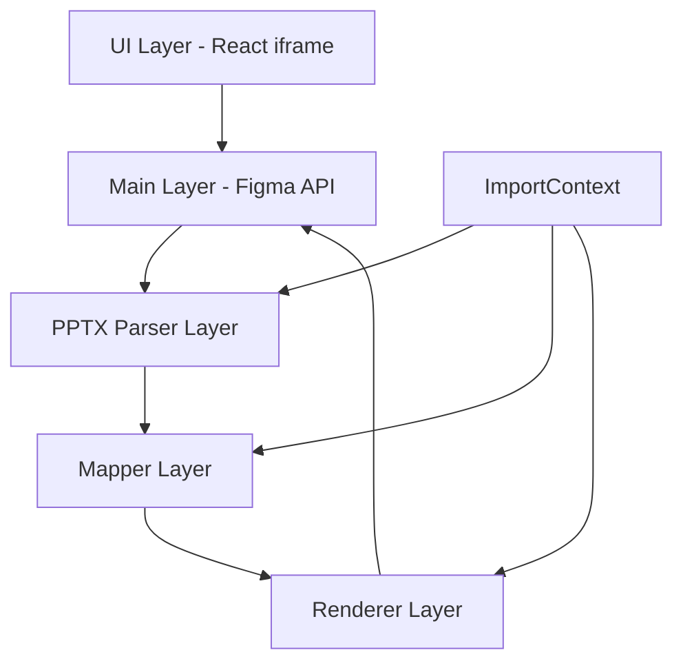

# PPTX Import Plugin для Figma

## Обзор проекта

**Цель**: Создание плагина для Figma, обеспечивающего импорт презентаций PowerPoint (.pptx) с максимально возможной точностью воспроизведения визуальных элементов, включая фон, текст, изображения и основные фигуры.

**Результат**: Каждый слайд презентации преобразуется в отдельный фрейм размером 1920×1080 пикселей с сохранением позиционирования и визуального оформления.

## Архитектура системы

### Слои архитектуры



### Компоненты системы

#### 1. UI Layer (React iframe)
- **Назначение**: Пользовательский интерфейс
- **Технологии**: React, TypeScript
- **Функции**:
  - Drag & Drop зона для файлов
  - Настройки импорта
  - Прогресс-бар с этапами
  - Панель результатов и предупреждений

#### 2. Main Layer (Figma Plugin API)
- **Назначение**: Координация процесса импорта
- **API**: Figma Plugin API
- **Функции**:
  - Обработка файлов PPTX
  - Создание узлов Figma
  - Управление жизненным циклом плагина

#### 3. PPTX Parser Layer
- **Назначение**: Парсинг структуры PPTX
- **Технологии**: JSZip, XML parsing
- **Функции**:
  - Распаковка ZIP архива
  - Чтение presentation.xml, slideN.xml
  - Обработка мастер-слайдов и тем
  - Извлечение медиа-файлов

#### 4. Mapper Layer
- **Назначение**: Преобразование OOXML в доменные модели
- **Функции**:
  - Создание абстракций (TextRun, Paragraph, Shape, Image, Group)
  - Применение тем и цветовых схем
  - Обработка иерархии элементов

#### 5. Renderer Layer
- **Назначение**: Создание узлов Figma
- **Функции**:
  - Преобразование абстракций в узлы Figma
  - Применение стилей и свойств
  - Масштабирование и позиционирование

#### 6. ImportContext
- **Назначение**: Кэширование и управление состоянием
- **Функции**:
  - Кэш шрифтов и медиа-файлов
  - Дедупликация ресурсов
  - Отслеживание прогресса

## Технологический стек

### Основные технологии
- **TypeScript** (strict mode)
- **React** (UI компоненты)
- **Vite** (UI сборка) + **ESBuild** (main сборка)
- **JSZip** + **fast-xml-parser** (работа с PPTX)
- **Zustand** (управление состоянием UI)
- **xxhash-wasm** (хэширование для дедупликации)
- **Figma Plugin API**

### Стандарты разработки
- **SOLID принципы**
- **KISS** (Keep It Simple, Stupid)
- **DRY** (Don't Repeat Yourself)
- **TypeScript strict mode**
- **ESLint + Prettier**

## Функциональные требования

### 1. Парсинг PPTX
- Распаковка ZIP архива
- Чтение всех необходимых XML файлов
- Конвертация единиц EMU → px (1in = 914400 EMU)

### 2. Обработка текста
- Поддержка многостильных runs
- Свойства символов: family, weight, italic, size, color, opacity
- Форматирование абзацев: выравнивание, отступы, line-height
- Нативные списки Figma (bulleted/numbered)
- Авто-подгонка текста

### 3. Обработка фигур
- Основные типы: RECTANGLE, ELLIPSE, TRIANGLE, LINE, ARROW, STAR
- Свойства: размер, позиция, rotation, заливки, обводки
- Фигурные стрелки через VECTOR пути
- Группировка shape + text

### 4. Обработка изображений
- Извлечение из ppt/media/*
- Встраивание (без ссылок)
- Дедупликация по хэшу
- Обработка crop/rotation/EXIF

### 5. Мастер-слайды и фон
- Наследование стилей из master/layout
- Переключатель "Включать фон мастера"
- Переопределения на уровне слайда

### 6. Масштабирование
- Fit до 1920×1080 с полями
- Центрирование контента
- Применение масштаба ко всем элементам

## Нефункциональные требования

### Производительность
- Обработка файлов 100+ слайдов без заморозки UI
- Парсинг в Web Worker, рендеринг в main с yield между слайдами
- Кэширование ресурсов и дедупликация по хэшу
- Батчевое создание узлов Figma с предварительной валидацией

### Надежность
- Per-slide try/catch обработка ошибок
- Подробное логирование и отчеты
- Graceful degradation для неподдерживаемых элементов

### Совместимость
- Актуальный Figma Plugin API с feature detection
- TypeScript strict mode
- Полностью локальная обработка
- Авто-детект версий PPTX с graceful degradation

## Этапы разработки

### Этап 1: Базовая инфраструктура
- [ ] Настройка проекта и сборки
- [ ] Создание UI компонентов
- [ ] Базовая интеграция с Figma API
- [ ] Структура парсера PPTX

### Этап 2: Парсинг и маппинг
- [ ] Реализация PPTX Parser
- [ ] Создание доменных моделей
- [ ] Обработка тем и цветовых схем
- [ ] Базовый маппинг элементов

### Этап 3: Рендеринг элементов
- [ ] Рендеринг текста
- [ ] Рендеринг фигур
- [ ] Обработка изображений
- [ ] Группировка и иерархия

### Этап 4: Продвинутые функции
- [ ] Мастер-слайды и фон
- [ ] Списки и авто-подгонка
- [ ] Градиенты и эффекты
- [ ] Обработка неподдерживаемых элементов

### Этап 5: Оптимизация и тестирование
- [ ] Производительность и кэширование
- [ ] Обработка ошибок
- [ ] Тестирование на различных файлах
- [ ] Документация и примеры

## Структура проекта

```
PPTX-import/
├── src/
│   ├── ui/                 # React компоненты UI (Vite)
│   ├── main/              # Основная логика плагина (ESBuild)
│   ├── parser/            # Парсинг PPTX (Web Worker)
│   ├── mapper/            # Маппинг OOXML → доменные модели
│   ├── renderer/          # Рендеринг в Figma узлы
│   ├── shared/            # Общие типы и утилиты
│   ├── context/           # ImportContext и кэширование
│   ├── workers/           # Web Workers для парсинга
│   └── theme/             # Обработка тем и цветовых схем
├── docs/                  # Документация проекта
├── tests/                 # Тесты (unit + integration + E2E)
├── assets/                # Ресурсы (иконки, конфиги, шрифты)
├── config/                # Конфигурационные файлы
└── manifest.json          # Манифест плагина
```

## Критерии приемки

### Функциональные
- Геометрия и позиции: расхождение ≤ 1 px
- Цвета и прозрачность визуально совпадают
- Списки отрисованы нативно с корректными отступами
- Фон слайдов соответствует оригиналу
- Shape+text сгруппированы правильно

### Технические
- Импорт больших файлов без аварий
- Детерминированный прогресс
- Подробные предупреждения и логи
- Graceful degradation для неподдерживаемых элементов

### Качество кода
- TypeScript strict mode
- Покрытие тестами критических компонентов
- Линтинг и форматирование
- Документированные API

## Ограничения MVP

### Не включается в MVP
- Анимации и переходы
- Видео и аудио
- Продвинутые художественные эффекты
- Тени и свечения (с предупреждением)
- CLI/headless режим

### Обработка неподдерживаемых элементов
- SmartArt/диаграммы: попытка растра/векторизации
- EMF/WMF: извлечение превью
- При неудаче: плейсхолдер + предупреждение

## Мониторинг и поддержка

### Логирование
- Уровни: info/warn/error
- Источник: слайд/элемент
- Типичные предупреждения документированы

### Обновления
- Регулярное обновление документации
- Отслеживание изменений в Figma API
- Обратная совместимость

---

**Версия документа**: 1.0  
**Дата создания**: 2024-12-19  
**Последнее обновление**: 2024-12-19
